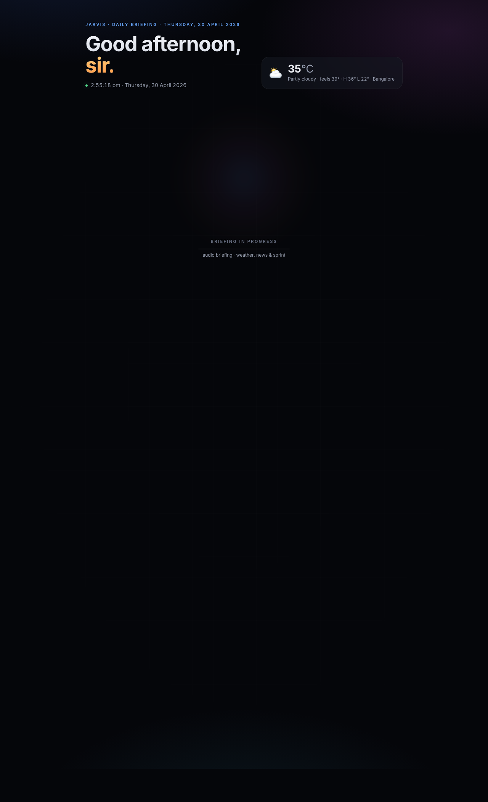
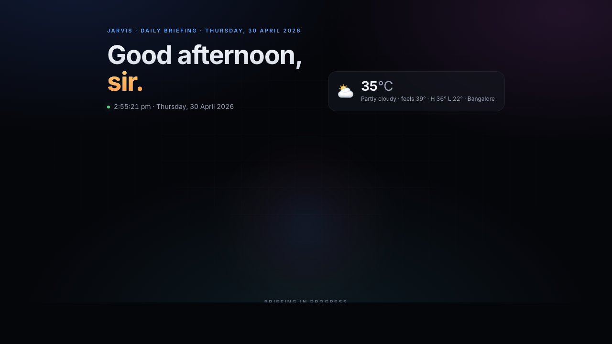

# Jarvis Daily Briefing

A self-contained daily briefing artifact: a polished HTML page with an audio-reactive 3D orb that reads you a Jarvis-style spoken summary of the **time, weather, top India news, and your sprint board** for the day.

  



```
$ python briefing.py --tickets examples/tickets.example.json --open
✓ weather fetched (32°C, clear)
✓ 5 headlines from Google News RSS
✓ ElevenLabs TTS rendered (1.9 MB, 75s)
✓ briefing.html written (2.6 MB) — opening in browser
```

The orb is a Three.js icosahedron with a simplex-noise vertex shader and an iridescent fresnel fragment shader. While the audio plays, the Web Audio API's `AnalyserNode` samples low-mid frequencies and feeds the amplitude into the shader as a uniform — the orb's rotation, scale, and surface displacement react to the voice in real time:



## What you get

A single self-contained `briefing.html` (audio embedded as base64 — no network calls when you click play) with:

- **Live IST clock** + dynamic greeting (good morning / afternoon / evening)
- **Weather card** — current temp, feels-like, daily H/L (open-meteo, no API key)
- **3D shader orb** — Three.js icosahedron with simplex-noise vertex displacement, iridescent fresnel, audio-reactive scale & rotation via Web Audio AnalyserNode
- **Playback controls** — pause / restart / stop, glass buttons that appear during playback
- **News headlines** — top India stories from Google News RSS, source-attributed
- **Sprint board** — your tickets, color-coded by priority, with "due today" callouts and click-through to Jira

## Setup

```bash
git clone https://github.com/YOU/jarvis-daily-briefing
cd jarvis-daily-briefing
python3 -m venv .venv && source .venv/bin/activate
pip install -r requirements.txt
cp examples/config.example.toml config.toml
# edit config.toml — at minimum set elevenlabs.voice_id and (optionally) jira host/jql
```

### TTS — ElevenLabs (recommended)

1. Sign up at https://elevenlabs.io (10K characters/month free, ~50 daily briefings)
2. Generate an API key
3. Either:
   - **macOS Keychain** (recommended): `security add-generic-password -s elevenlabs -a default -w 'sk_...'`
   - **Env var**: `export ELEVENLABS_API_KEY=sk_...`
4. Pick a voice — set `voice_id` in `config.toml`. Defaults that work well:
   - `JBFqnCBsd6RMkjVDRZzb` — George (warm British baritone, Jarvis-like)
   - `onwK4e9ZLuTAKqWW03F9` — Daniel (British, well-spoken)
   - `IKne3meq5aSn9XLyUdCD` — Charlie (Australian, butler vibe)

### TTS — Kokoro local fallback (optional)

If ElevenLabs fails (quota exceeded, network issue), the script falls back to local [Kokoro](https://github.com/hexgrad/Kokoro) on-device TTS. Quality is lower but it's free and offline.

```bash
pip install kokoro soundfile
# Pre-cache the spaCy model so it doesn't try to download at runtime:
pip install https://github.com/explosion/spacy-models/releases/download/en_core_web_sm-3.8.0/en_core_web_sm-3.8.0.tar.gz
```

### Tickets

Tickets are read from a JSON file you provide. Three options:

**(a) From any Atlassian Cloud REST API** — works if your org allows personal API tokens with Basic Auth:

```bash
python briefing.py --jira-host yourorg.atlassian.net \
                   --jira-email you@example.com \
                   --jira-token "$(security find-generic-password -s atlassian -w)" \
                   --jql "assignee = currentUser() AND sprint in openSprints() AND statusCategory != Done"
```

**(b) From a JSON file you maintain** (works behind any corporate firewall):

```bash
python briefing.py --tickets tickets.json
```

See [`examples/tickets.example.json`](examples/tickets.example.json) for the schema.

**(c) Skip tickets entirely** — get just the weather/news briefing:

```bash
python briefing.py --no-tickets
```

### Corporate proxy (TLS-intercepting)

If you're behind a TLS-inspecting proxy (e.g. ZScaler, Q2 Enterprise) Python's `requests` will fail SSL handshakes. Two fixes:

1. **`truststore`** (recommended) — uses your macOS / Windows / Linux system trust store automatically: `pip install truststore` then run with `--use-system-trust`
2. **CA bundle env var**: extract corporate root + system roots into a single PEM and set `REQUESTS_CA_BUNDLE`. The script picks it up.

## Usage

```bash
# One-off briefing for today, opened in your browser
python briefing.py --tickets tickets.json --open

# Save to a custom location
python briefing.py --tickets tickets.json --out ~/Desktop/briefing.html

# Skip TTS (text-only artifact)
python briefing.py --tickets tickets.json --no-tts --open

# Use a different voice
python briefing.py --tickets tickets.json --voice-id onwK4e9ZLuTAKqWW03F9

# Different city (defaults to Bangalore — coords in config.toml)
python briefing.py --tickets tickets.json --lat 28.6 --lon 77.2 --city "New Delhi"
```

## Daily automation (macOS)

Schedule it via launchd to fire every weekday morning. Example plist at [`examples/launchd.plist`](examples/launchd.plist) — install with:

```bash
cp examples/launchd.plist ~/Library/LaunchAgents/com.jarvis.briefing.plist
launchctl load ~/Library/LaunchAgents/com.jarvis.briefing.plist
```

Edit the times and paths to taste. The agent fires `python briefing.py --open` so the artifact appears in your default browser at the scheduled time.

## Architecture

```
briefing.py
├── load config.toml + CLI flags
├── fetch_weather()     ← open-meteo HTTP API (no key)
├── fetch_news()        ← Google News RSS (no key)
├── load_tickets()      ← JSON file or Jira REST
├── build_prose()       ← deterministic template, no LLM required
├── synthesize_audio()  ← ElevenLabs primary, Kokoro fallback
└── build_artifact()    ← inject data into briefing.html template
```

The template at [`templates/briefing.html`](templates/briefing.html) contains the entire UI: aurora background, hero with live clock, weather card, shader orb (Three.js), news list, sprint board, playback controls. All styles are inline; the only external resources are Google Fonts and Three.js via CDN.

## Why this exists

A real Jarvis-flavoured morning brief that:
- Doesn't require you to log in to anything at 9 AM
- Doesn't leak data to a third-party dashboard
- Reads the briefing aloud in a voice you actually want to hear
- Survives corporate networks that block standard API token auth

Built originally for behind-Q2 Atlassian usage where personal Basic-Auth tokens are blocked at the gateway, then generalized.

## License

MIT — see [LICENSE](LICENSE).
